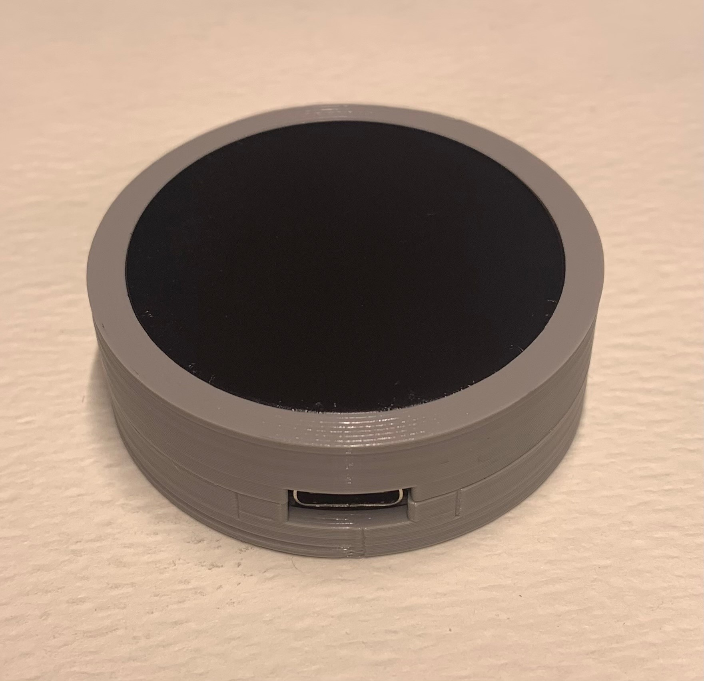

<!---  Open Source Assistive Technology: GitHub Readme Template  --->
<!-- Template files available at https://github.com/makersmakingchange/OpenAT-Template -->
 
<!-- TITLE -->
# Touchpad Joystick

<!-- SUMMARY -->
The Touchpad Joystick is a joystick that is activated by touch. This device is a more affordable option to many commercial joysticks and trackpads on the market. This is a USB joystick that can be plugged into either the left, or right USB joystick of the Xbox Adaptive Controller.

The Touchpad Joystick is comprised of a commercially available capacitive touch sensor (Cirque Capacitive Touch Sensor 35 mm) that is mounted in a 3d printed enclosure.

This Joystick was designed by Ron Nelson. 

<!-- PHOTO --->

## Makers Making Change Assistive Device Library
 - https://www.makersmakingchange.com/s/product/touchpad-joystick/](https://www.makersmakingchange.com/s/product/touchpad-joystick/01tJR000000Be3lYAC

## Getting Started

### 1. Order the Off-The-Shelf Components
The [Bill of Materials](/Documentation/Touchpad_Joystick_BOM.csv) lists all of the parts and components required to build the Touchpad Joystick. The electronic components may be available locally, but will probably need to be ordered online. 

### 2. Print the 3D Printable components
Print the components for the switch tester case and choose an option for the case.

All of the files and individual print files can be in the [/Build_Files/3D_Printing_Files](/Build_Files/3D_Printing_Files/) folder.

### 3. Assemble the Touchpad Joystick
Reference the [assembly guide](/Documentation/Touchpad_Joystick_Assembly_Guide.pdf) for the tools and steps required to build each portion.

## Files
<!--- FILES --->

### Documentation
<!--- DOCUMENTATION --->
| Document | Version | Link |
|----------|---------|------|
| Design Rationale     | 1.0 | [Touchpad_Joystick_Design_Rationale](/Documentation/Touchpad_Joystick_Design_Rationale.pdf) |
| Bill of Materials    | 1.0 | [Touchpad_Joystick_BOM](/Documentation/Touchpad_Joystick_BOM.csv) |
| Assembly Guide       | 1.0 | [Touchpad_Joystick_Assembly_Guide](/Documentation/Touchpad_Joystick_Assembly_Guide.pdf) |
| Maker Checklist      | 1.0 | [Touchpad_Joystick_Checklist](/Documentation/Touchpad_Joystick_Maker_Checklist.pdf) |
| User Quick Guide     | 1.0 | [Touchpad_Joystick_User_Quick_Guide](/Documentation/Touchpad_Joystick_User_Guide.pdf)           |
| Changelog            | 1.0 | [Touchpad_Joystick_Changelog](/Documentation/Touchpad_Joystick_Changelog.pdf)               |

### Build Files
<!--- BUILD FILES --->
 - [3D Printing Files](/Build_Files/3D_Printing_Files)

## License
<!--- LICENSE --->
Everything needed or used to design, make, test, or prepare the Touchpad Joystick is licensed under the CERN 2.0 Weakly Reciprocal license <https://ohwr.org/project/cernohl/wikis/Documents/CERN-OHL-version-2> (CERN-OHL-W).

All software is under the GNU General Public License v3.0 (GPL-3.0). 

Accompanying material such as instruction manuals, videos, and other copyrightable works that are useful but not necessary to design, make, test, or prepare the Touchpad Joystick are published under a Creative Commons Attribution-ShareAlike 4.0 license <https://creativecommons.org/licenses/by-sa/4.0/> (CC BY-SA 4.0).

## Attribution
<!--- ATTRIBUTION --->
 - The original design was created by [Ron Nelson](https://github.com/nelsonii) under an [MIT License](https://github.com/nelsonii/JoystickEnclosures/blob/main/LICENSE)
 - Documentation by Neil Squire Society / Makers making Change
 - The documentation template was created by [Neil Squire](https://www.neilsquire.ca/) / [Makers Making Change](https://makersmakingchange.com/) and is used under a CC BY-SA 4.0 license. It is available at the following link: https://github.com/makersmakingchange/OpenAT-Template

----

<!-- ABOUT MMC START -->
## About Makers Making Change

Makers Making Change is an initiative of [Neil Squire](https://www.neilsquire.ca/), a Canadian non-profit that uses technology, knowledge, and passion to empower people with disabilities.

We are committed to cultivating a network of volunteer makers who support people with disabilities in their communities through cost effective assistive technology. Check out our library of free, open-source assistive technologies.

 - Website: [www.MakersMakingChange.com](https://www.makersmakingchange.com/)
 - [GitHub](https://github.com/makersmakingchange)
 - [Thingiverse](https://www.thingiverse.com/makersmakingchange/about)
 - Twitter: [@makermakechange](https://twitter.com/makermakechange)
 - Instagram: [@makersmakingchange](https://www.instagram.com/makersmakingchange)

### Contact Us
For technical questions, to get involved, or to share your experience we encourage you to visit [MMC Forum](https://forum.makersmakingchange.com) or contact info@makersmakingchange.com
<!-- ABOUT MMC END -->
